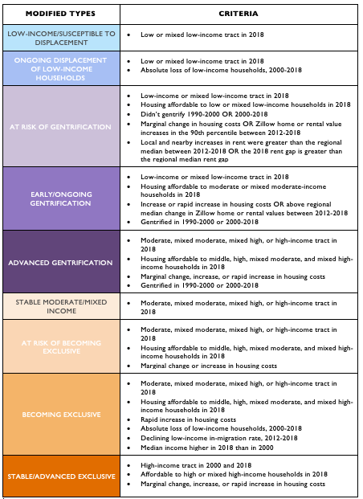

  

# Displacement and Gentrification Typologies

  

<!-- TABLE OF CONTENTS -->
## Table of Contents

* [Project Overview](#project-overview)
* [Typologies](#typologies)
* [Code & Usage](#Code-&-Usage)
* [Contact](#contact)
* [Existing Maps](#existing-maps)
* [Download Data](#download-data)
* [Cite the Code](#citation)

<!-- ABOUT THE PROJECT -->
## Project Overview

Since 2011, UC Berkeley's [Urban Displacement Project](https://urbandisplacement.org) has partnered with universities, government agencies, philanthropy, and local organizations, in an effort to understand unique dynamics of displacement and potential negative impacts of gentrification on communities across the United States.  These efforts have culminated in the creation of interactive [typology maps](https://urbandisplacement.org), which summarize housing market dynamics and displacement and gentrification risk into eight distinct categories. 
 
This repository holds all the code needed to produce [UDP's Displacement Typology maps](https://urbandisplacement.org). By making annotated codebooks available online, UDP hopes to provide an opportunity for others to improve and build upon past research, in order to better capture dynamics in jurisdictions we’ve previously researched. Our Jupyter notebooks will make it possible for us to crowdsource the local knowledge about places that our secondary data sources often fail to capture. We also hope that methods can be more easily adapted and applied to other cities and regions, starting conversations around local dynamics of neighborhood change.  
 
*Any modified code that is taken from this repo and not reviewed by the Urban Displacement Project is not endorsed by us and should be documented accordingly as not endorsed by the Urban Displacement Project.*
 
<!-- TYPOLOGIES -->
## Typologies

UDP's Displacement Typologies use housing and demographic data from the US Census, as well as real estate market data from Zillow to classify a metropolitain area's census tracts into eight distinct categories. Each category represents a stage of neighborhood change, although should not be taken to represent a linear trajectory or to predetermine neighborhood outcomes. Instead, typologies allow practictionners and researchers to see patterns in their regions over a specified time period, and are meant to start conversations about how policy interventions and investment could respond and support more equitable development.

It is important to note that in considering the entire metropolitan region, UDP's typologies classify both low- and middle-income neighborhods at risk of or experiencing displacement or gentrification, as well as high-income neighborhoods where housing markets are becoming increasingly 'exclusive' to low income residents. UDP believes that classifying tracts in such a way allows practionners to get a broader picture of neighborhood dynamics, specifically the concentration of poverty and wealth within a region. 

UDP's Typologies have evovled over time in response to community and partner feedback and the availability of new data sources. This code represents the code's most recent iteration. It makes use of data from the 2013-2018 American Community Survey; 1990, 2010 and 2000 Dicennial Census; and 2012-2017 Zillow Home Value and Rent Indices. Overlay data comes from a variety of sources, detailed in `code/README.md`.

**Typologies Graphic**

<!-- CODE & USAGE -->
## Code & Usage
 
To run the code, fork this repository and navigate to the `code/README.md` file and follow the instructions. You will have to edit the files to include your state and city accordingly. Once completed, follow the instructions in the `README` to download all external datasets for your specific region that will be required, then run the five consecutive files of code in a terminal window, as indicated in the `README` replacing your state/city name.
 
<!-- CONTACT -->
## Contact or issues
 
This is a work in progress and we happily invite community feedback and collaboration in improving this work. If you find a bug or have questions about our code, analysis, or anything else regarding this repo/project, please create an [issue](https://github.com/urban-displacement/displacement-typologies/issues) and ping `@timathomas`. You're also welcome to reach out via email at <info@urbandisplacement.org> to ask us for questions, help, or suggestions.
 
<!-- EXISTING MAPS -->
## Existing Maps

* Atlanta: 
  * [2018 Map](https://urban-displacement.github.io/displacement-typologies/maps/atlanta_udp.html)
  * [2017 Map](https://urban-displacement.github.io/displacement-typologies/maps/atlanta_sparcc.html)
* Bay Area: 
  * [2018 Map](https://urban-displacement.github.io/displacement-typologies/maps/sanfrancisco_udp.html)
* Chicago: 
  * [2018 Map](https://urban-displacement.github.io/displacement-typologies/maps/chicago_udp.html)
  * [2017 Map](https://urban-displacement.github.io/displacement-typologies/maps/chicago_sparcc.html)
* Cleveland: 
  * [2018 Map](https://urban-displacement.github.io/displacement-typologies/maps/cleveland_udp.html)
* Denver:
  * [2018 Map](https://urban-displacement.github.io/displacement-typologies/maps/denver_udp.html)
  * [2017 Map](https://urban-displacement.github.io/displacement-typologies/maps/denver_sparcc.html)
* Los Angeles: 
  * [2018 Map](https://urban-displacement.github.io/displacement-typologies/maps/losangeles_udp.html)
* Memphis: 
  * [2017 Map](https://urban-displacement.github.io/displacement-typologies/maps/memphis_sparcc.html)
* Seattle/Puget Sound: 
  * [2018 Map](https://urban-displacement.github.io/displacement-typologies/maps/seattle_udp.html)

<!-- DOWNLOAD DATA -->
## Download Data

* GeoPackages (similar to shapefiles) & CSV's with GEOID & Typologies: [Download](https://github.com/urban-displacement/displacement-typologies/tree/main/data/downloads_for_public)
* Full typology data as CSV: [Download](https://github.com/urban-displacement/displacement-typologies/tree/main/data/outputs/typologies)
* Codebook for full typology dataset: [link](https://github.com/urban-displacement/displacement-typologies/blob/main/data/outputs/typologies/typologies_codebook.md)

## Citation
Thomas, Tim, Anna Driscoll, Gabriela Picado Aguilar, Carson Hartman, Julia Greenberg, Alex Ramiller, Anna Cash, Miriam Zuk, and Karen Chapple. “Urban-displacement/displacement-typologies: Release 1.1”. https://github.com/urban-displacement/displacement-typologies. doi:10.5281/zenodo.4356684.
